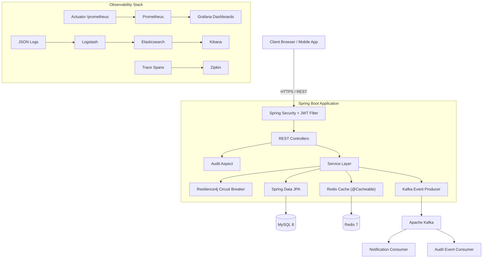

# System Architecture

## Overview
TrustBank is an enterprise-grade, secure banking platform built on Spring Boot 3. It features an event-driven architecture, distributed caching, full observability, and resilient fault tolerance — designed for high-throughput, multi-instance production deployments.

## High-Level Architecture Diagram

## Core Components

### Application Layer
1. **Security Layer**: JWT-based stateless auth + RBAC (USER / ADMIN roles)
2. **REST Controllers**: RESTful API with OpenAPI 3.0 documentation
3. **Service Layer**: Business logic with `@Transactional`, idempotency keys, and optimistic locking
4. **AOP Auditing**: Automatic audit trail via `@Around` advice on critical operations

### Infrastructure Layer
5. **Redis Cache**: Distributed caching with `@Cacheable` / `@CacheEvict` — eliminates redundant DB queries
6. **Apache Kafka**: Event-driven architecture with async notification and audit consumers
7. **Resilience4j**: Circuit breakers + retries protecting Kafka producers from cascading failures
8. **Bucket4j Rate Limiting**: Per-IP rate limiting at the filter level

### Observability Layer
9. **Prometheus + Grafana**: JVM, HTTP, Hikari, and custom business metrics
10. **ELK Stack**: Structured JSON logging with Logstash → Elasticsearch → Kibana
11. **Zipkin + OpenTelemetry**: Distributed tracing with trace ID propagation

## Tech Stack
*   **Runtime**: Java 17, Spring Boot 3.3.5
*   **Database**: MySQL 8, Flyway migrations, Hikari connection pool
*   **Cache**: Redis 7 (distributed, LRU eviction)
*   **Messaging**: Apache Kafka (KRaft mode)
*   **Security**: Spring Security, JWT, BCrypt, Bucket4j
*   **Resilience**: Resilience4j (Circuit Breaker, Retry)
*   **Metrics**: Micrometer + Prometheus + Grafana
*   **Logging**: Logback + Logstash Encoder → ELK
*   **Tracing**: Micrometer Tracing + OpenTelemetry → Zipkin
*   **API Docs**: SpringDoc OpenAPI (Swagger UI)
*   **CI/CD**: GitHub Actions, JaCoCo, CodeQL SAST, Docker Publish
*   **Testing**: JUnit 5, Mockito, K6 load testing
