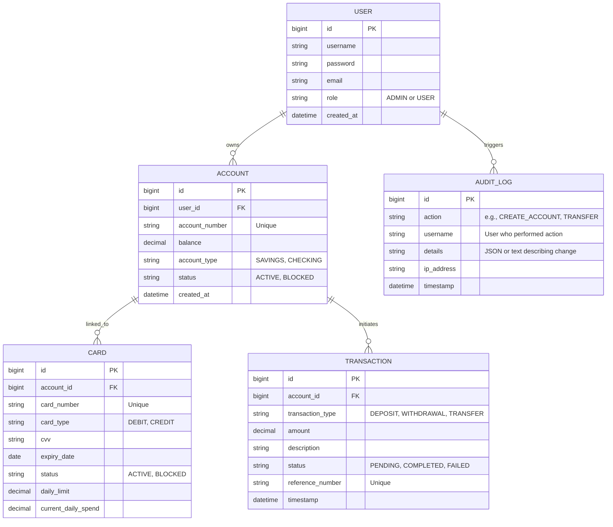

# Database Schema

The database relies on a normalized relational schema to ensure data integrity and track all financial actions.

## Entity Relationship Diagram

## Schema Details
* **Users**: Stores authentication credentials and role definitions.
* **Accounts**: Financial accounts linked to users. The balance is tracked here.
* **Cards**: Physical/virtual cards linked to accounts. Has spending limits to prevent fraud.
* **Transactions**: Immutable ledger of all financial movements.
* **AuditLogs**: Automatically populated by the `AuditAspect` to ensure compliance and track admin/user actions.
